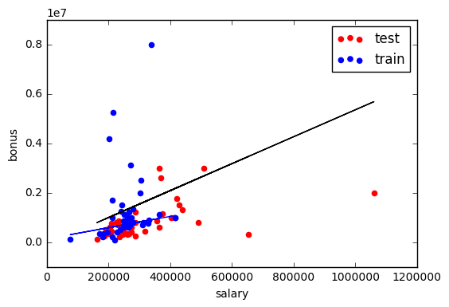

### Regression Mini Project
In this project, you will use regression to predict financial data for Enron employees and associates. Once you know some financial data about an employee, like their salary, what would you predict for the size of their bonus?


```python
#!/usr/bin/python

"""
    Starter code for the regression mini-project.

    Loads up/formats a modified version of the dataset
    (why modified?  we've removed some trouble points
    that you'll find yourself in the outliers mini-project).
    Draws a little scatterplot of the training/testing data
    You fill in the regression code where indicated:
"""    


import sys
import pickle
sys.path.append("../tools/")
from feature_format import featureFormat, targetFeatureSplit
dictionary = pickle.load( open("../final_project/final_project_dataset_modified.pkl", "r") )

### list the features you want to look at--first item in the
### list will be the "target" feature
features_list = ["bonus", "salary"]
data = featureFormat( dictionary, features_list, remove_any_zeroes=True)
target, features = targetFeatureSplit( data )

### training-testing split needed in regression, just like classification
from sklearn.cross_validation import train_test_split
feature_train, feature_test, target_train, target_test = train_test_split(features, target, test_size=0.5, random_state=42)
train_color = "b"
test_color = "r"

#The data is splitted into train and test sets.
```

```python
### Your regression goes here!
### Please name it reg, so that the plotting code below picks it up and
### plots it correctly. Don't forget to change the test_color above from "b" to
### "r" to differentiate training points from test points.

from sklearn import linear_model
reg = linear_model.LinearRegression()

reg.fit(feature_train, target_train)
reg.coef_ , reg.intercept_

```
    (array([ 5.44814029]), -102360.54329388007)

```python

### draw the scatterplot, with color-coded training and testing points
import matplotlib.pyplot as plt
for feature, target in zip(feature_test, target_test):  # zip function takes iterables
    plt.scatter( feature, target, color= 'r' )
for feature, target in zip(feature_train, target_train):
    plt.scatter( feature, target, color= 'b' )

### labels for the legend
plt.scatter(feature_test[0], target_test[0], color= 'r', label="test")
plt.scatter(feature_train[0], target_train[0], color= 'b', label="train")


### draw the regression line, once it's coded
try:
    plt.plot( feature_test, reg.predict(feature_test), color = 'black' )
except NameError:
    pass
plt.xlabel(features_list[1])
plt.ylabel(features_list[0])
plt.legend()
plt.show()
```


Run the starter code found in regression/finance_regression.py. This will draw a scatterplot, with all the data points drawn in. What target are you trying to predict? What is the input feature being used to predict it?

Mentally (or better yet, print out the scatterplot and use paper and pencil) sketch out the regression line that you roughly predict.


"Bonus" is the regression target. The input feature "salary" is used to predict "bonus".

Import LinearRegression from sklearn, and create/fit your regression. Name it reg so that the plotting code will show it overlaid on the scatterplot. Does it fall approximately where you expected it?

Extract the slope (stored in the reg.coef_ attribute) and the intercept. What are the slope and intercept?


```python
reg.coef_ , reg.intercept_
```

    (array([ 5.44814029]), -102360.54329388007)

Imagine you were a less savvy machine learner, and didn’t know to test on a holdout test set. Instead, you tested on the same data that you used to train, by comparing the regression predictions to the target values (i.e. bonuses) in the training data. What score do you find? You may not have an intuition yet for what a “good” score is; this score isn’t very good (but it could be a lot worse).


```python
reg.fit(feature_train, target_train)
reg.score(feature_train, target_train)
```

    0.045509192699524359

Now compute the score for your regression on the test data, like you know you should. What’s that score on the testing data? If you made the mistake of only assessing on the training data, would you overestimate or underestimate the performance of your regression?


```python
reg.fit(feature_train, target_train)
reg.score(feature_test, target_test)  #reg score can be negative because the model can be arbitarily worse
```

    -1.484992417368511

There are lots of finance features available, some of which might be more powerful than others in terms of predicting a person’s bonus. For example, suppose you thought about the data a bit and guess that the “long_term_incentive” feature, which is supposed to reward employees for contributing to the long-term health of the company, might be more closely related to a person’s bonus than their salary is.

A way to confirm that you’re right in this hypothesis is to regress the bonus against the long term incentive, and see if the regression score is significantly higher than regressing the bonus against the salary. Perform the regression of bonus against long term incentive--what’s the score on the test data?


```python

### list the features you want to look at--first item in the
### list will be the "target" feature
features_list = ["bonus", "long_term_incentive"]
data = featureFormat( dictionary, features_list, remove_any_zeroes=True)
target, features = targetFeatureSplit( data )

### training-testing split needed in regression, just like classification
from sklearn.cross_validation import train_test_split
feature_train, feature_test, target_train, target_test = train_test_split(features, target, test_size=0.5, random_state=42)
train_color = "b"
test_color = "b"
```


```python
reg = linear_model.LinearRegression()

reg.fit(feature_train, target_train)
reg.coef_ , reg.intercept_

```

    (array([ 1.19214699]), 554478.75621500914)


```python
reg.score(feature_test, target_test)
```

    -0.59271289994986431


If you had to predict someone’s bonus and you could only have one piece of information about them, would you rather know their salary or the long term incentive that they received?

Long term incentive, because it has a larger score than salary does.

This is a sneak peek of the next lesson, on outlier identification and removal. Go back to a setup where you are using the salary to predict the bonus, and rerun the code to remind yourself of what the data look like. You might notice a few data points that fall outside the main trend, someone who gets a high salary (over a million dollars!) but a relatively small bonus. This is an example of an **outlier**, and we’ll spend lots of time on them in the next lesson.

A point like this can have a big effect on a regression: if it falls in the training set, it can have a significant effect on the slope/intercept if it falls in the test set, it can make the score much lower than it would otherwise be. As things stand right now, this point falls into the test set (and probably hurting the score on our test data as a result). Let’s add a little hack to see what happens if it falls in the training set instead. Add these two lines near the bottom of finance_regression.py, right before plt.xlabel(features_list[1]):

reg.fit(feature_test, target_test)

plt.plot(feature_train, reg.predict(feature_train), color="b")

Now we’ll be drawing two regression lines, one fit on the test data (with outlier) and one fit on the training data (no outlier). Look at the plot now--big difference, huh? That single outlier is driving most of the difference. What’s the slope of the new regression line?

(That’s a big difference, and it’s mostly driven by the outliers. The next lesson will dig into outliers in more detail so you have tools to detect and deal with them.)


```python
reg = linear_model.LinearRegression()

reg.fit(feature_train, target_train)
reg.coef_ , reg.intercept_


for feature, target in zip(feature_test, target_test):  # zip function takes iterables
    plt.scatter( feature, target, color= 'r' )
for feature, target in zip(feature_train, target_train):
    plt.scatter( feature, target, color= 'b' )

### labels for the legend
plt.scatter(feature_test[0], target_test[0], color= 'r', label="test")
plt.scatter(feature_train[0], target_train[0], color= 'b', label="train")


### draw the regression line, once it's coded
try:
    plt.plot( feature_test, reg.predict(feature_test), color = 'black' )
except NameError:
    pass

reg.fit(feature_test, target_test)
plt.plot(feature_train, reg.predict(feature_train), color="b")

plt.xlabel(features_list[1])
plt.ylabel(features_list[0])
plt.legend()
plt.show()
```




```python
 reg.coef_
```
    array([ 2.27410114])


The slope is about 2.27 after removing the outlier, which is a big difference from what we had before (about 5.4).  A small number of outliers makes a big difference!

(When fitting on test data, the slope is changed so much because the outlier.)
